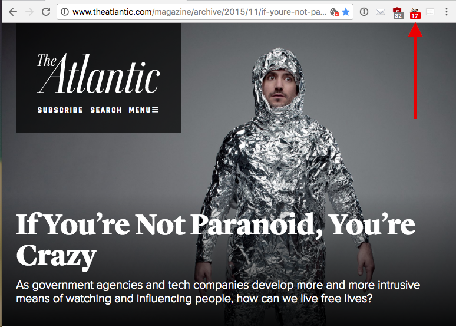

# Introduction

> All human beings have three lives: public, private, and secret.

― Gabriel Garcí­a Márquez, Gabriel García Márquez: a Life

> If only the “controversial” stuff is private, then privacy is itself suspicious. Thus, privacy should be on by default.

— [Tim Bray](https://www.tbray.org/ongoing/When/201x/2012/12/02/HTTPS)

We live more and more of our lives digitally. We consistently create and entrust significant portions of our social, health, financial, and work data with web services. We then link that data together by connecting accounts and permitting the services that we use to track the other sites we visit. Our use of search engines can predict patterns and insights into our health and personalities. In 2016 John Paparrizos MSc, Ryen W. White PhD, and Eric Horvitz MD, PhD published [a study](http://jop.ascopubs.org/content/early/2016/06/02/JOP.2015.010504.abstract) where they were able to use anonymized Bing search queries to predict Pancreatic cancer.

In the article [With Great Data Comes Great Responsibility](https://medium.com/@jazzpazz/with-great-data-comes-great-responsibility-72d3e1c94e27#.twfg85eus) Pascal Raabe (Paz) eloquently describes the way our digital data represents our lives:

> We’re now producing more data on a daily basis than through all of history. The digital traces we’re leaving behind with every click, every tweet and even every step that we make create a time machine for ourselves. These traces of our existence form the photo album of a lifetime. We don’t have to rely on memory alone but can turn to technology to augment our biological memories and virtually remember everything.

In the light of how much data we produce, The security of our data has become a major point of concern among many people. Web surveillance, corporate tracking, and data leaks have even become common leading news stories. In a [2016 Pew Research survey](http://www.pewresearch.org/fact-tank/2016/01/20/the-state-of-privacy-in-america/) on the state of privacy in America, it was found that few Americans are confident in the security or privacy of our data.

> Americans express a consistent lack of confidence about the security of everyday communication channels and the organizations that control them – particularly when it comes to the use of online tools. And they exhibited a deep lack of faith in organizations of all kinds, public or private, in protecting the personal information they collect. Only tiny minorities say they are “very confident” that the records maintained by these organizations will remain private and secure.

In 2016 the writer Walter Kirn wrote about the state of modern surveillance for the Atlantic magazine in an article titled [If You’re Not Paranoid, You’re Crazy](http://www.theatlantic.com/magazine/archive/2015/11/if-youre-not-paranoid-youre-crazy/407833/). The online version of the article, hosted on the Atlantic's website, contains at least 17 detected user trackers[^1] (upper right in the image below). Even when we are discussing tracking, we are creating data that is being tracked.

[^1]: As detected by the Privacy Badger browser plugin

## Our Responsibility

As web developers we are the first line of defense in protecting our user's data and privacy. In this title, we will explore some ways in which we can work to maintain the privacy and security of our user's data. The four main concepts we'll cover are:

1. Respecting user privacy settings
2. Encrypting user connections with our sites
3. Working to ensure the security of our user's information
4. Providing a means for users to export their data

If we define ethics as "making choices that have the most positive effect for the largest number of people," putting in place strong security protections and placing privacy and data control in the hands of our users can be considered the ethical approach. By taking extra care to respect our user's privacy and security, we are showing greater commitment to their needs and desires.
